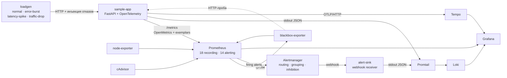

# observability-stack

Стенд из Prometheus, Alertmanager, Grafana, Loki и Tempo вокруг инструментированного
сервиса, на котором можно за десять минут довести реальный алерт до срабатывания и
проследить его путь от правила до уведомления.

---

## Задача

«У нас есть дашборды» — это не наблюдаемость. Дашборд отвечает на вопрос, который
вы уже задали; наблюдаемость нужна для вопросов, которые вы задать не догадались.
Практически это выглядит так: графики зелёные, пользователи пишут в поддержку, и
никто не может сказать, когда именно началось.

Вторая половина той же проблемы — качество алертов. Типичный набор правил
устроен так: `CPU > 80%`, `memory > 90%`, `disk > 85%`, `5xx > 0` — десятки
порогов на *причины*. Они срабатывают, когда всё в порядке, и молчат, когда
сервис деградирует медленно. Через два месяца дежурный удаляет письма не читая, а
ещё через месяц из-за этого пропускают настоящую аварию.

Этот репозиторий — про противоположный подход:

- алертов мало (14), и каждый описывает **симптом**, который чувствует
  пользователь: запросы падают, запросы медленные, эндпоинт недоступен, диск
  вот-вот кончится;
- пороги выведены из **бюджета ошибок**, а не выбраны на глаз;
- у каждого алерта есть `summary`, `description` и `runbook_url`, и ссылка ведёт
  в существующий раздел — это проверяется тестом;
- каждое правило покрыто **юнит-тестом `promtool`**: доказано, что оно
  срабатывает на нужном ряде и молчит на похожем. Правило, которое никто никогда
  не видел сработавшим, — это гипотеза, а не алерт.

---

## Архитектура



Три сигнала связаны не «лежат рядом», а ссылками:

- гистограмма латентности несёт **exemplar** с `trace_id` — клик по всплеску на
  графике открывает конкретный трейс в Tempo;
- каждая строка лога содержит тот же `trace_id`; datasource Loki превращает его
  в ссылку (`derivedFields`), а Tempo умеет обратный переход (`tracesToLogsV2`);
- уведомления Alertmanager тоже пишутся в stdout и попадают в Loki, поэтому
  «что сработало» и «что реально доставлено» — два разных запроса, а не догадка.

---

## Быстрый старт

```bash
make up            # собрать и поднять весь стек
make demo-errors   # прогнать сценарий отказов, довести алерт до firing
make check-alerts  # что горит в Prometheus, Alertmanager и в приёмнике
make down
```

| Сервис | Адрес |
|---|---|
| Grafana | http://localhost:3000 (анонимный вход, Viewer) |
| Prometheus | http://localhost:9090 |
| Alertmanager | http://localhost:9093 |
| sample-app | http://localhost:8000/docs |
| alert-sink | http://localhost:9095/alerts |

`make` — обёртка; всё то же самое делается через `docker compose`, команды видны
в `make -n <цель>`.

---

## Демо: как увидеть, что алерт действительно срабатывает

### Что реально наблюдалось

Ниже — не пересказ конфигурации, а лог живого прогона: стек поднят
`docker compose up -d`, трафик 10 req/s на `/api/items`, через 90 секунд ровной
работы включается инъекция 100% ответов 503.

| От включения отказа | Событие | Чем подтверждено |
|---|---|---|
| +0:00 | `POST /faults/errors {"ratio": 1.0, "status_code": 503}` | HTTP 200 от сервиса |
| +0:40 | `ErrorBudgetBurnFast` → **pending** | `GET /api/v1/alerts` в Prometheus |
| +2:40 | `ErrorBudgetBurnFast` → **firing** | там же; `for: 2m` отработал целиком |
| +2:40 | алерт принят Alertmanager'ом | `GET /api/v2/alerts`, state `active` |
| +2:40 | уведомление доставлено в приёмник | `GET /alerts/firing` на alert-sink |
| +2:40 | SLI в этот момент: `ratio_rate5m` = `ratio_rate1h` = **0.689**, `rate5m` = 9.82 req/s | recording-правила через API Prometheus |
| +2:40 | `ProbeFailed` → pending независимо от метрик | blackbox-проба `/api/items` увидела тот же отказ снаружи процесса |
| +8:10 | отказ снят, `ErrorBudgetBurnFast` исчез | 330 секунд после снятия — короткое 5-минутное окно ушло под порог первым |

Повторный прогон на пустом TSDB дал ту же картину со сдвигом: pending на +0:45,
firing на +4:07, доставка в приёмник в ту же секунду. Разброс времени между
pending и firing (2:00 против 3:22) объясняется тем, что в начале инцидента
пятиминутное окно ещё наполняется и `and` в правиле на одном-двух тактах не
выполняется, сбрасывая таймер `for`.

Отдельно проверены на живом стенде, инъекцией алертов в API Alertmanager:

| Проверка | Результат |
|---|---|
| critical подавляет warning того же `job` | warning переходит `active` → **suppressed**, `inhibitedBy` непустой |
| `TargetDown` подавляет метрические алерты своего `job` | `HighErrorRatio` → **suppressed** |
| `ProbeFailed` подавляет `ProbeSlow` того же `instance` | `ProbeSlow` → **suppressed** |
| маршрут critical | доставлено в приёмник `pager` |
| маршрут warning | доставлено в приёмник `tickets` (через `group_wait: 2m`) |
| `make reload` | правило исправлено и применено без перезапуска Prometheus |

> **Чего наблюдать не довелось.** `ErrorBudgetBurnSlow` до firing не доводился:
> ему нужно `for: 15m`, а прогон был короче. Сценарии `latency-spike` и
> `traffic-drop` целиком не гонялись. Для этих трёх случаев времена в таблицах
> ниже — расчётные: выведены из порогов, окон и `for`, а не сняты секундомером.
> Сам факт «сработает / не сработает» при этом закреплён юнит-тестами
> `promtool`, которые подают ровно те ряды, что создают сценарии.

Приведённые ниже времена — для стенда, который уже проработал час и успел набрать
базовую линию. На только что поднятом стенде окна `rate()` короче фактического
времени работы, и алерты загораются раньше — что и видно в наблюдении выше.

### `make demo-errors`

Сценарий `error-burst`: 5 минут чистого трафика 20 req/s, затем 25 минут, в
которых 35% запросов к `/api/*` отвечают 503, затем 10 минут восстановления.

| Время от старта | Что происходит | Где смотреть |
|---|---|---|
| 0:00 | loadgen сбрасывает инъекции и даёт ровные 20 req/s | Grafana → *RED overview*, панель «Request rate» ≈ 20 |
| 5:00 | armed `POST /faults/errors {"ratio": 0.35}` | в логе loadgen строка `armed fault kind=errors` |
| 5:15 | `ratio_rate5m` уходит к 0.35 — это 350x бюджета | *SLO and error budget* → «Availability burn rate», серия 5m |
| ≈7:30 | `ratio_rate1h` пересекает `14.4 × 0.001` | `ErrorBudgetBurnFast` → **pending** на `/alerts` в Prometheus |
| ≈9:30 | истекает `for: 2m` | `ErrorBudgetBurnFast` → **firing** |
| ≈9:40 | Alertmanager отдаёт группу (`group_wait: 10s` для critical) | `make check-alerts` показывает строку `notified` |
| ≈26:00 | `ratio_rate6h` и `ratio_rate30m` оба выше `6 × 0.001`, истёк `for: 15m` | `ErrorBudgetBurnSlow` → firing, но Alertmanager **гасит** его: inhibition «critical подавляет warning для того же `job`» |
| 30:00 | инъекция снята | короткое окно (5m) первым уходит под порог |
| ≈35:00 | оба алерта resolved | в `alert-sink` появляются записи со `status: resolved` |

Что стоит проверить руками в этот момент:

```bash
# 1. Правило действительно сработало
curl -s localhost:9090/api/v1/alerts | python -m json.tool

# 2. Алерт дошёл до Alertmanager и не был съеден маршрутизацией
curl -s localhost:9093/api/v2/alerts | python -m json.tool

# 3. Уведомление реально доставлено
curl -s localhost:9095/alerts/firing | python -m json.tool

# всё три сразу, с разметкой по источникам
make check-alerts
```

Расхождение между первым и третьим — самая полезная находка на этом стенде: оно
означает, что маршрут или inhibition-правило проглотили алерт, и это конфигурационный
баг, который иначе всплыл бы только в следующую аварию.

### `make demo-latency`

Каждому запросу добавляется 700 ± 200 мс, то есть 100% запросов оказываются за
порогом 300 мс. Короткое окно насыщается за секунды, но `LatencyBudgetBurnFast`
ждёт, пока часовое окно наберёт 14.4% — это ≈8.6 минуты — и ещё 2 минуты `for`.
Итого firing примерно на 16-й минуте прогона. Это не задержка реакции, а
конструкция: пятиминутный всплеск не должен будить человека.

### `make demo-traffic-drop`

20 минут по 25 req/s, затем 0.2 req/s. Ничего не падает и ничего не тормозит,
поэтому **все SLO-алерты молчат** — числитель и знаменатель исчезли вместе.
Через ≈10 минут после обвала загорается `TrafficDropped`. Это единственный
сценарий, ради которого правило и написано.

### `make demo-normal`

30 минут ровного трафика. Ожидаемый результат — пустой вывод `make check-alerts`.
Стенд, который молчит, когда всё хорошо, — половина ценности всей конструкции.

---

## Что здесь измеряется

Числа получены запуском, не оценкой.

| | |
|---|---|
| Recording-правил | 18 |
| Алертов | 14 |
| Тест-кейсов `promtool` | 19 (61 проверка алертов + 19 проверок PromQL) |
| Python-тестов | 139 |
| Рядов в экспозиции `sample-app` | 91, из них 56 — бакеты гистограммы |
| Рядов `http_requests_total` | 5 после 1200 запросов по 909 различным URL |
| Различных значений метки `path` | 4 |
| Целей скрейпа в рантайме | 12, все `up` |
| Групп правил в рантайме | 9, `health=ok` у всех 32 правил |
| Контейнеров в стеке | 11, из них 10 с healthcheck — все проходят |
| Время до firing при полном отказе | 2:40 от инъекции (наблюдение, см. выше) |

Последние две строки — это и есть контроль кардинальности в действии:
909 URL превращаются в 4 значения метки, потому что в метку пишется шаблон
маршрута (`/api/items/{item_id}`), а не путь.

---

## Решения и компромиссы

### Multi-burn-rate вместо статических порогов

Статический порог вида `error_ratio > 0.05 for 5m` плох в обе стороны. Он молчит
при 4% ошибок, идущих сутками (а это 40 бюджетов подряд), и звонит при 6%,
которые продержались шесть минут (это 0.8% месячного бюджета — не повод будить).
Порог никак не связан с тем, что обещано пользователю.

Burn-rate связывает: порог считается из того, **сколько бюджета мы готовы
потратить до реакции**.

```
burn rate = (доля бюджета) × (окно SLO / окно алерта)
2% бюджета за 1 час  → 0.02 × 720/1 = 14.4   → страница
5% бюджета за 6 часов → 0.05 × 720/6 = 6     → тикет
```

Каждое длинное окно снабжено коротким (1/12 длины): без него алерт продолжает
гореть ещё час после конца инцидента, и дежурный перестаёт ему верить.

Цена: четыре range-запроса на каждый SLI вместо одного, и правила, которые
невозможно прочитать без документа. Поэтому арифметика вынесена в
[`slo/README.md`](slo/README.md), цели — в машиночитаемый
[`slo/sample-app.yml`](slo/sample-app.yml), а тест
`tests/test_slo_rules_consistency.py` падает, если YAML и PromQL разойдутся.

Что отвергнуто: генерация правил из SLO-описания (Sloth, Pyrra). На двух целях
генератор добавляет зависимость, шаг сборки и слой между тем, что написано, и
тем, что выполняется, — ради экономии сорока строк YAML. Начиная примерно с
десяти сервисов выбор становится обратным.

### Recording-правила и контроль кардинальности

Кардинальность режется в четырёх местах, и каждое решает свою задачу:

1. **В приложении.** Метка `path` — шаблон маршрута. Без этого каждый
   `/api/items/8461` был бы отдельным рядом. Запросы, не попавшие ни в один
   маршрут (сканеры, опечатки), сворачиваются в `__unmatched__` — иначе
   бот-сканер за ночь создаёт десятки тысяч рядов. Гистограмма длительности
   вообще не несёт метку `status`: 13 бакетов × число статусов — слишком дорого,
   а latency-SLO по определению считается по всем запросам.
2. **На скрейпе.** cAdvisor — крупнейший источник кардинальности в стеке;
   `metric_relabel_configs` оставляет четыре семейства метрик, которые реально
   читают дашборды, и сбрасывает метки `id`, `image`, `container_label_*`.
3. **В recording-правилах.** Агрегация до `job:` и `job_path:` убирает
   `instance`, `method`, `status`. Дашборды и алерты работают с рядами, которых
   единицы, а не с сырыми.
4. **В Loki.** `trace_id` — это structured metadata, а не метка. Меткой он
   породил бы по стриму на трейс; это классический способ убить Loki за сутки.

Правила названы по конвенции `level:metric:operations`; тест проверяет, что
имена ей соответствуют и что уровень агрегации — только `job` или `job_path`.
Стоимость: 18 правил надо поддерживать, и запрос «а какая была латентность у
конкретного инстанса» требует сырых метрик. Это осознанный размен: дашборд,
который каждые 30 секунд агрегирует сырьё, — первый кандидат на то, чтобы
положить Prometheus именно во время аварии.

### Loki, а не ELK

Для этого стенда решают три свойства:

- Loki индексирует только метки, а не содержимое строк. На одном хосте это
  разница между сотнями мегабайт под индекс и десятками;
- модель меток та же, что в Prometheus. Переход «график → логи за то же окно с
  теми же метками» не требует мысленного перевода между двумя системами;
- эксплуатация: один бинарь и файловая система против Elasticsearch с JVM,
  шардами и ILM.

Чем заплачено: полнотекстовый поиск в Loki — это последовательное чтение чанков.
На вопросе «найди эту строку за месяц по всем сервисам» ELK выигрывает
кратно. Здесь такой сценарий не нужен: вход в логи всегда начинается с окна и
сервиса, потому что до логов доходят через метрику или трейс. Если бы логи были
основным способом расследования — выбор был бы другим.

### Сэмплирование трейсов

Sampler — `ParentBased(TraceIdRatioBased(ratio))`, на стенде ratio = 1.0.
Head-based решение принимается один раз, в корневом спане, и наследуется всеми
дочерними: это единственный способ не получить рваные трейсы, когда сервисов
несколько.

Минус head-based известен: нельзя сказать «сохраняй все трейсы, которые
закончились ошибкой» — на момент решения о сэмплировании исход ещё неизвестен.
Правильный ответ — tail sampling в OpenTelemetry Collector, который буферизует
трейс целиком и решает по результату. Он сюда не добавлен сознательно: это
четвёртый компонент в конвейере и отдельная тема про его память и очереди, а на
20 req/s он не даёт ничего. Для продакшена план такой: ratio 1–5% для успешных
плюс tail-политика «всё, что error или дольше SLO-порога».

**Почему в Tempo выключен `metrics_generator`.** Он умеет строить span-метрики и
service graph, и это заманчиво: RED-метрики «бесплатно». Но span-метрики
считаются по **сэмплированным** трейсам. SLO, посчитанный по сэмплу, — это
оценка, поданная как измерение; при ratio 5% и бюджете 0.1% ошибка оценки больше
самого бюджета. Метрики приложения видят каждый запрос, поэтому источник истины
для алертов один — Prometheus. Service graph при необходимости строится в
Grafana из данных Tempo, но в бюджет ошибок он не входит.

### Pull, а не push

Prometheus ходит за метриками сам, и это даёт три вещи, которые в push-модели
приходится делать руками:

- `up` появляется бесплатно. В push-модели «сервис молчит» неотличимо от
  «сервиса нет в конфиге» — и `TargetDown` написать не из чего;
- цель метрик — список в конфигурации, а не то, что решило прислать приложение.
  Забытый инстанс виден как down, а не как тишина;
- нет обратного давления от приложения на систему мониторинга: медленный
  Prometheus замедляет скрейпы, а не обработчики запросов.

Границы у этого честные. Пул не достаёт до задач, которые живут меньше интервала
скрейпа (для них нужен Pushgateway или прямая запись), не работает через NAT без
доступа внутрь, и не годится для клиентских метрик. В этом стеке все цели —
долгоживущие сервисы в одной сети, поэтому pull подходит без оговорок. OTLP для
трейсов, наоборот, работает push'ом: трейс — это событие, у него нет
«текущего значения», которое можно опросить.

### Blackbox-пробы рядом с метриками приложения

Метрики процесса могут сообщить только о тех отказах, которые процесс пережил.
Есть целый класс аварий, при которых `/metrics` отдаётся идеально, а запросы не
обслуживаются:

- заблокирован event loop — фоновый поток экспозиции жив, обработчики стоят;
- слушающий сокет закрыт, но процесс не умер;
- запросы не доходят: ингресс, DNS, TLS, сетевая политика;
- сервис перестал получать трафик — метрик просто нет, а «нет данных» на
  дашборде выглядит как «нет проблем».

Проба закрывает эти случаи снаружи: `probe_success` — бинарный факт «снаружи
запрос выполняется». Разница между `probe_duration_seconds` и внутренним p99 —
это прямое измерение всего, что находится перед обработчиком.

Почему проба не стала SLI: одна проба раз в 15 секунд — это 5760 точек в сутки.
Одна неудачная проба — уже 0.017% «недоступности», две подряд выносят недельный
бюджет 99.9%. Строить бюджет на такой выборке нельзя, поэтому проба даёт
бинарный алерт, а SLI считается по реальному трафику.

### Exemplars: связь метрика → трейс

Приложение отдаёт `/metrics` с согласованием формата: обычному клиенту —
`text/plain`, Prometheus (который просит `application/openmetrics-text`) — с
exemplar'ами, где в каждом бакете гистограммы лежит `trace_id`. Prometheus
запущен с `--enable-feature=exemplar-storage`, Grafana знает
`exemplarTraceIdDestinations`. Практически это означает: всплеск на графике
латентности — кликабельный, и клик открывает именно тот запрос, который его
создал.

Цена — одна строка на бакет в экспозиции и явный флаг у Prometheus, без которого
exemplar'ы молча выбрасываются. Оба поведения (с exemplar'ами и без) закреплены
тестами: `test_openmetrics_scrape_carries_trace_exemplars` и
`test_default_scrape_omits_exemplars`.

### Что намеренно не алертится

Это тот раздел, который делает набор правил коротким.

| Не алертится | Почему |
|---|---|
| CPU, память, нагрузка контейнера | Насыщение — причина, а не симптом. Сервис на 95% CPU, укладывающийся в оба SLO, — вопрос ёмкости, а не звонок ночью. Метрики есть на дашбордах для того, кто уже разбирается с инцидентом. |
| Рестарты и OOM-kill контейнера | Перезапустившийся под, который не задел ни один SLI, — событие для еженедельного разбора. Если задел — уже горит burn-rate. |
| Число 4xx | 404 и 422 — это поведение клиента. Алерт на них перекладывает чужую ошибку на дежурного и позволяет сломанному клиенту жечь бюджет здорового сервиса. |
| p99 латентности как таковой | SLO написано про долю запросов за порогом, а не про квантиль. Квантиль по инстансам не усредняется, и алерт на нём начинает зависеть от того, сколько инстансов сейчас живо. |
| Отсутствие метрики («no data») | Покрыто более честными сигналами: `TargetDown` (скрейп не идёт), `ProbeFailed` (снаружи не отвечает), `TrafficDropped` (трафика нет). Алерт «нет данных» не отличает эти три случая, а действия в них разные. |
| Загрузка диска без тренда | Раздел, год стоящий на 8% свободного, — не инцидент. В правиле есть и уровень, и `predict_linear`; юнит-тест «низко, но стабильно → тишина» это фиксирует. |
| Ошибки Grafana, Loki, Tempo | Их падение не влияет на пользователя сервиса. Мета-мониторинг ограничен тем, что делает *слепым сам мониторинг*: `PrometheusRuleEvaluationFailing` и `AlertmanagerNotificationsFailing`. |

Обратная сторона: часть аварий будет замечена не мгновенно, а через SLI. Это
принято сознательно — при 14 алертах каждое срабатывание что-то значит, и цена
пропущенных 10 минут ниже цены дежурного, который перестал читать почту.

### Прочие развилки

**Health-эндпоинты исключены из SLI.** `/healthz`, `/readyz`, `/metrics` и
`/faults` не считаются в `http_requests_total`. Иначе постоянный поток
гарантированно успешных проверок сидит в знаменателе и завышает доступность:
при 20 req/s пользовательского трафика и скрейпе раз в 5 секунд это уже
искажение, а на малонагруженном сервисе оно становится основным сигналом.
`/healthz` при этом не остаётся без надзора — его смотрит blackbox-проба.

**Inhibition вместо отключения правил.** `DiskSpaceLow` и `DiskWillFillSoon`
описывают одну ситуацию с разной срочностью и при заполняющемся диске горят
вместе. Убирать одно из правил нельзя — они ловят разные скорости; поэтому
warning гасится Alertmanager'ом, когда для того же объекта уже есть critical.
То же для `TargetDown`, который подавляет все метрические алерты своего джоба:
пока цель не скрейпится, они говорят о прошлом.

**Порог алерта записан как `14.4 * 0.001`, а не как `0.0144`.** Выражение
дороже на одно умножение, зато из правила видно, откуда взялось число, и тест
может прочитать его обратно и сверить с `slo/sample-app.yml`.

**Список исключённых файловых систем длиннее, чем кажется нужным.** Он собран не
по документации, а по факту первого запуска стека: на Docker Desktop
node-exporter видит диск `C:` хоста через 9p-проброс WSL и показывает его
**четыре раза** — `/mnt/host/c`, `/parent-distro/mnt/host/c`,
`/usr/lib/wsl/drivers`, `/parent-distro/usr/lib/wsl/drivers`. Диск был занят на
98.9%, и `DiskSpaceLow` с `DiskWillFillSoon` ушли в pending восемью алертами о
чужом диске — ровно тот сорт шума, после которого правило отключают целиком.
Поэтому в селекторе стоит `fstype!~"tmpfs|overlay|squashfs|ramfs|9p|fuse.*|nfs.*|cifs|autofs"`:
tmpfs и ramfs — это память, overlay и squashfs — read-only образ контейнера, а
9p, fuse, nfs и cifs — чужая ёмкость, за которую этот узел не отвечает. Случай
закреплён юнит-тестом (`memory-backed and pass-through mounts are excluded`),
чтобы исключение нельзя было потерять при следующей правке.

---

## Юнит-тесты на правила

`promtool test rules` — то, что отличает набор правил от набора гипотез. Тесты
подают синтетические ряды и проверяют не только «сработало», но и метки,
и полностью развёрнутые аннотации — то есть заодно и шаблонизацию.

Что проверяется, кроме очевидного:

- **калибровка порогов.** 5x burn — тишина, 7.5x — тикет, 350x — страница.
  Изменение множителя ломает CI, а не продакшен;
- **отрицательные случаи.** Шестиминутная полная остановка загоняет
  `slow_ratio_rate5m` в 1.0 — и ни один алерт не срабатывает. Отдельный
  `promql_expr_test` доказывает, что всплеск действительно был, то есть тишина
  не оттого, что данные плоские;
- **естественно тихий сервис** не порождает `TrafficDropped` (страховка
  `rate6h > 1`);
- **раздел на 8% свободного, но стабильный** не алертится, а такой же с трендом
  к нулю — алертится;
- **точные значения recording-правил** и то, что маршрут без ошибок даёт
  *отсутствие ряда*, а не ноль.

Утверждения о firing сделаны в моменты, когда все окна `rate()` целиком лежат
внутри инцидента. Это не косметика: пока окно пересекает начало инцидента,
`$value` в аннотации зависит от порядка вычисления групп правил внутри одного
такта, и тест на переходном процессе оказывается нестабильным. Проверено —
пять последовательных прогонов всего набора дают идентичный результат.

---

## Проверки

```bash
make lint    # yamllint, promtool check config/rules, amtool check-config,
             # валидность JSON дашбордов, ruff, mypy --strict
make test    # promtool test rules + pytest
```

Что именно выполняется и что получилось на последнем прогоне:

| Проверка | Команда | Результат |
|---|---|---|
| Конфигурация Prometheus | `promtool check config prometheus/prometheus.yml` | SUCCESS, 2 файла правил |
| Правила | `promtool check rules recording.yml alerting.yml` | SUCCESS, 18 + 14 правил |
| Юнит-тесты правил | `promtool test rules prometheus/rules/tests/*_test.yml` | SUCCESS ×5 файлов |
| Конфигурация Alertmanager | `amtool check-config alertmanager/alertmanager.yml` | SUCCESS, 3 inhibit-правила, 3 приёмника |
| Дашборды | `python -m json.tool grafana/dashboards/*.json` | 3 файла валидны |
| PromQL дашбордов | 31 выражение прогнано через `promtool check rules` | SUCCESS |
| YAML | `yamllint -c .yamllint.yml .` | без замечаний |
| Python | `ruff check .` · `mypy --strict` (16 модулей) · `pytest` | всё зелёное, 139 тестов |
| Compose | `docker compose config` · `docker compose --profile load build` | валиден, 3 образа собраны |
| Живой стек | `docker compose up -d` | 11 контейнеров, 10 healthcheck'ов проходят |

promtool и amtool запускаются из тех же зафиксированных образов, что и сам стек:
инструмент, который проверяет правила, должен быть той же версии, что их
выполняет. Ровно те же шаги делает CI (`.github/workflows/ci.yml`) в трёх
задачах — правила, Python, compose.

---

## Структура

```
.
├── docker-compose.yml          весь стек, образы с фиксированными тегами
├── Makefile                    up / down / demo-* / check-alerts / lint / test
├── prometheus/
│   ├── prometheus.yml          скрейпы, blackbox-пробы, exemplar storage
│   └── rules/
│       ├── recording.yml       18 правил, конвенция level:metric:operations
│       ├── alerting.yml        14 алертов, все с runbook_url
│       └── tests/              юнит-тесты promtool (19 кейсов)
├── alertmanager/
│   └── alertmanager.yml        маршруты, группировка, inhibition, mute-окно
├── slo/
│   ├── sample-app.yml          цели как данные, источник истины для порогов
│   └── README.md               арифметика burn rate и выбор окон
├── grafana/
│   ├── provisioning/           datasources и провайдер дашбордов
│   └── dashboards/             RED overview, SLO/бюджет, логи+трейсы
├── loki/ · promtail/ · tempo/  конфигурации хранилищ логов и трейсов
├── blackbox/                   модули проб
├── sample-app/                 FastAPI, RED-метрики, OTLP, инъекция отказов
├── loadgen/                    генератор нагрузки, 4 сценария, только stdlib
├── alert-sink/                 приёмник вебхуков + утилита check-alerts
├── tests/                      сверка slo/*.yml с правилами и рунбуками
└── docs/runbooks.md            по разделу на каждый алерт
```

---

## Лицензия

MIT — см. [LICENSE](LICENSE).
